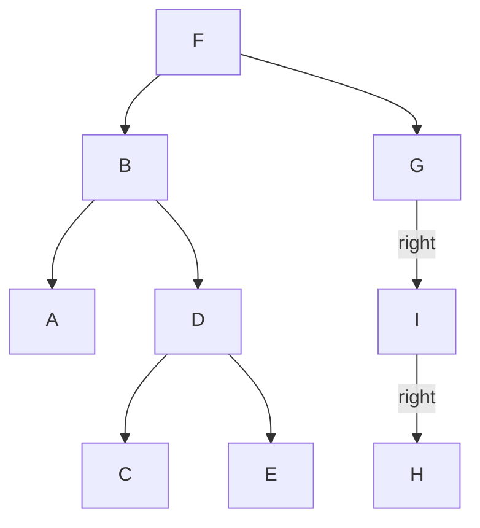

# Binary Trees

A binary tree is a data structure where each node has 0, 1 or two children,
referred to as `left child` and `right child`. A node without a parent is
called a `root`, nodes without children are called `leaves`.

Each node has 0-N `ancestors`, which refers to the parent chain up to the root,
and `descendants`, in the direction of the leaves. The `depth` is the level of
the node in comparison to the roots (root is lv1, both its children are lv2)
and so on.

## Types of Binary Trees

* Complete Tree: is a tree that is filled (as in, each node has at 2 nodes
  except for the leaves), and all the leaves in the last level are as far left
  as possible.

  ```mermaid
  graph TD
    1 --> 2
    1 --> 3
    2 --> 4
    2 --> 5
    3 --> 6
    3 --> 7
    4 --> 8
  ```

* Full Tree: is a tree in which every node has either 0 or 2 children.

  ```mermaid
  graph TD
    1 --> 2
    1 --> 3
    2 --> 4
    2 --> 5
    3 --> 6
    3 --> 7
  ```

Which can be represented with the following:

``` rust
pub type Child<T> = Option<Box<Node<T>>>;

#[derive(Clone, Debug)]
pub struct Node<T: Clone + Copy + Debug>(pub T, pub Child<T>, pub Child<T>);

#[derive(Clone, Debug)]
pub struct BinaryTree<T: Clone + Copy + Debug>(pub Node<T>);
```

In accordance to how the borrow check in rust works, it can not recurse on
itself unless it's wrapped by an `Rc` or an `Box`. We're also going to be using
it for all the implementations unless stated otherwise, to maintain consistency
and focus on the algorithms themselves. The contained types must implement
Copy, but that's just to make things a lot easier.

In addition, we also use the following methods to make creating the trees easier:

```rust
pub fn node2<T: Clone + Copy + Debug>(name: T, left: Node<T>, right: Node<T>) -> Node<T> {
    Node(name, Some(Box::new(left)), Some(Box::new(right)))
}

pub fn node1r<T: Clone + Copy + Debug>(name: T, right: Node<T>) -> Node<T> {
    Node(name, None, Some(Box::new(right)))
}

pub fn node1l<T: Clone + Copy + Debug>(name: T, right: Node<T>) -> Node<T> {
    Node(name, Some(Box::new(right)), None)
}

pub fn node0<T: Clone + Copy + Debug>(name: T) -> Node<T> {
    Node(name, None, None)
}
```

## Tree Traversal

Is the process of visiting (checking, updating) each node in a tree structure,
exactly once. Unlike linked lists and arrays, which are usually traversed in
linear order, trees may be traversed in two "main" ways:

* **Breadth-first**: check all the nodes on a certain level then going to
  the next one.
* **Depth-first**: check all the nodes in a certain "lineage", then come back
  and follow the other paths.

Other algorithms are usually variations of those two types.

The tree used for the tests is the following:



With the helpers provided earlier, we can create it like this:

```rust
BinaryTree(node2(
		"F",
		node2("B", node0("A"), node2("D", node0("C"), node0("E"))),
		node1r("G", node1r("I", node0("H"))),
));
```

Unless specified otherwise, the Rust implementations will expose the same
interface and can be tested with:

```rust
traverse_tree(tree, &|&node| {
    println!(" -> {}", node);
});
```

### Pre-order Traversal (root -> left -> right)

1. Check if the current node is empty or null.
2. Visit the root/current node.
3. Traverse the left subtree, by recursively calling the function with the
   current node as the new root.
4. Traverse the right subtree, by recursively calling the function with the
   current node as the new root.

```rust
pub fn traverse_tree<T: Clone + Copy + Debug>(tree: BinaryTree<T>, fun: &Fn(&T)) {
    traverse(&Some(Box::new(tree.0)), fun);
}

pub fn traverse<T: Clone + Copy + Debug>(node: &Child<T>, fun: &Fn(&T) -> ()) {
    if let Some(node) = node {
        fun(&node.0);

        traverse(&node.1, fun);
        traverse(&node.2, fun);
    }
}
```

Result:

```
 -> F -> B -> A -> D -> C -> E -> G -> I -> H
```

### In-order Traversal (left -> root -> right)

1. Check if the current node is empty or null.
3. Traverse the left subtree, by recursively calling the function with the
   current node as the new root.
2. Visit the root/current node.
4. Traverse the right subtree, by recursively calling the function with the
   current node as the new root.

```rust
pub fn traverse_tree<T: Clone + Copy + Debug>(tree: BinaryTree<T>, fun: &Fn(&T)) {
    traverse(&Some(Box::new(tree.0)), fun);
}

pub fn traverse<T: Clone + Copy + Debug>(node: &Child<T>, fun: &Fn(&T) -> ()) {
    if let Some(node) = node {
        traverse(&node.1, fun);
        fun(&node.0);
        traverse(&node.2, fun);
    }
}
```

Result:

```
 -> A -> B -> C -> D -> E -> F -> G -> I -> H
```

### Post-order Traversal (left -> right -> root)

1. Check if the current node is empty or null.
3. Traverse the left subtree, by recursively calling the function with the
   current node as the new root.
4. Traverse the right subtree, by recursively calling the function with the
   current node as the new root.
2. Visit the root/current node.

```rust
pub fn traverse_tree<T: Clone + Copy + Debug>(tree: BinaryTree<T>, fun: &Fn(&T)) {
    traverse(&Some(Box::new(tree.0)), fun);
}

pub fn traverse<T: Clone + Copy + Debug>(node: &Child<T>, fun: &Fn(&T) -> ()) {
    if let Some(node) = node {
        traverse(&node.1, fun);
        traverse(&node.2, fun);
        fun(&node.0);
    }
}
```

Result:

```
 -> A -> C -> E -> D -> B -> H -> I -> G -> F
```

### Level-order Traversal

To do the level-order traversal of the tree, we need a Queue, or some other
form of collection that supports FIFO (First in, First out). For the Rust
examples, I'm using the [queues][1] crate.

1. Initialize an empty queue, and add the root to it.
3. While the queue is not empty:
  1. Visit the node.
  2. If present, add left child to the queue.
  3. If present, add right child to the queue.

```rust
pub fn traverse_tree<T: Clone + Copy + Debug>(tree: BinaryTree<T>, fun: &Fn(&T)) {
    traverse(&Some(Box::new(tree.0)), fun);
}

pub fn traverse<T: Clone + Copy + Debug>(node: &Child<T>, fun: &Fn(&T) -> ()) {
    if let Some(node) = node {
        let mut nodes = queue![];

        nodes.add(node);

        while let Ok(top) = nodes.remove() {
            fun(&top.0);

            if let Some(ref left) = top.1 {
                nodes.add(left);
            };

            if let Some(ref right) = top.2 {
                nodes.add(right);
            };
        }
    }
}
```

### Reverse Level-order Traversal


```rust
pub fn traverse_tree<T: Clone + Copy + Debug>(tree: BinaryTree<T>, fun: &Fn(&T)) {
    traverse(&Some(Box::new(tree.0)), fun);
}

pub fn traverse<T: Clone + Copy + Debug>(node: &Child<T>, fun: &Fn(&T) -> ()) {
    let mut queue: Queue<&Node<T>> = queue![];
    let mut stack: Vec<&Node<T>> = vec![];

    if let Some(node) = node {
        queue.add(node);

        while let Ok(top) = queue.remove() {
            // Remember to revert the order, as adding it left to right would
            // also invert the childs in the tree.
            if let Some(ref right) = top.2 {
                queue.add(right);
            };

            if let Some(ref left) = top.1 {
                queue.add(left);
            };

            stack.push(top);
        }
    }

    while let Some(node) = stack.pop() {
        fun(&node.0);
    }
}
```

Result:

```
 -> C -> E -> H -> A -> D -> I -> B -> G -> F
```

## References

* [This amazing playlist by LucidProgramming][0]

[0]: https://www.youtube.com/watch?v=6oL-0TdVy28&list=PL5tcWHG-UPH2fmYC6kgey1RIxP2iK9EEL
[1]: https://gitlab.com/rust-algorithms/queues
